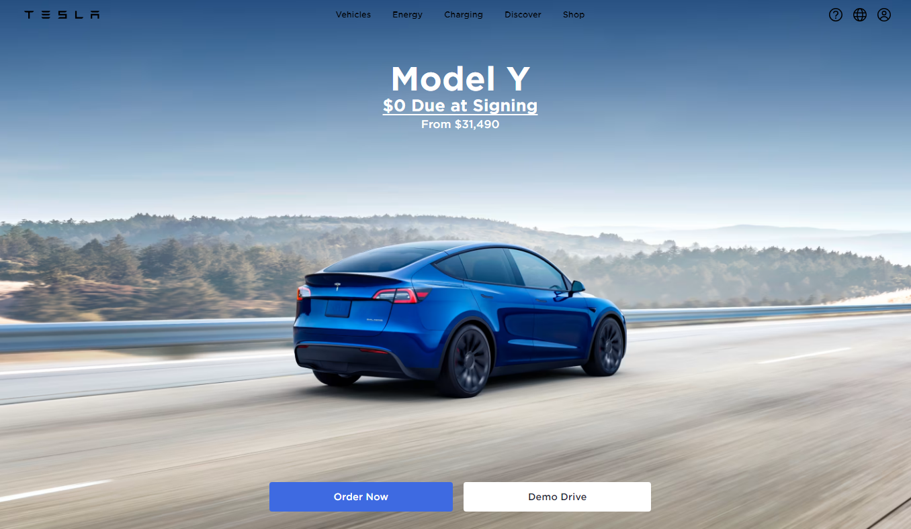

# Clon de la Landing Page de Tesla



## Descripción

Este proyecto es un clon de la landing page de Tesla, creado con el objetivo de practicar y demostrar habilidades en el desarrollo web. Utiliza **Astro** para la creación de sitios estáticos, **Tailwind CSS** para estilos rápidos y personalizados, y un poco de **JavaScript** para implementar funcionalidades interactivas.

## Estructura del Proyecto

Dentro de tu proyecto Astro, verás la siguiente estructura de carpetas y archivos:

```text
/
├── public/
│   └── favicon.svg
├── src/
│   ├── components/
│   │   └── Card.astro
│   ├── layouts/
│   │   └── Layout.astro
│   └── pages/
│       └── index.astro
└── package.json